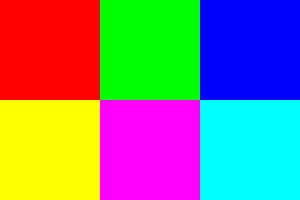

# Manipulations d'images

Le but de cette page est de présenter quelques façons de manipuler les images "à la main" c'est à dire sans utiliser les fonctions déjà toutes faites dans un module. Cette présentation est très largement inspirée d'un très bon cours de [CG]Maxime de ce site mais plus sous forme d'exercices et en français. J'ai, de plus, fait le choix de transformer les images en tableau numpy car je trouvais la façon de faire plus "mathématique".

Remarques :  
De base, on charge la photo [Lenna](https://en.wikipedia.org/wiki/Lenna) utilisée classiquement dans les présentations de manipulations de photos. mais vous pouvez utiliser une autre photo en remplaçant `image=np.asarray(image_entrée)` par le tableau numpy de votre photo.  
Il n'y a pas d'autocorrection ici. Si le code est valide, la barre s'affichera en vert même s'il ne répond pas à la question.

## Le script de base 

Juste quelques mots sur ce qui apparait de base dans les scripts qui vont suivre :

@[Le script de base]({"stubs": ["Info/Manip_image_base.py"], "command": "sh -c 'python3 Info/Manip_image_base.py  && python3 Info/afficher_images.py'"})

Tout d'abord, on importe le module PIL qui permet la manipulation d'image (ici elle nous servira principalement pour ouvrir et sauvegarder une image, étant donné que l'on va plutôt manipuler à la main nos données).
On importe aussi numpy qui permet de travailler assez facilement avec des tableaux de données (entre autre).

Ensuite, On ouvre notre image puis on la traduit en tableau numpy. Du coup, chaque pixel est représenté dans le tableau par un triplet (r,v,b) où r, v et b sont des nombres entre 0 et 255 représentant la "proportion" de rouge, vert et bleu respectivement dans la couleur de ce pixel. Attention : les pixels sont reprérés dans le tableau par la ligne et la colonne (comme dans une matrice). Autrement dit, pour récupérer le pixel tout en bas à gauche, on utilisera `image[511,0]` (car l'image est de dimension 512 par 512). Ce n'est donc pas la notation standard en coordonnées mais plutôt celle des matrices.

On récupère ensuite les dimensions de l'image. `nb_lignes` représente le nombre de lignes de notre tableau et `nb_colonnes` le nombre de colonnes.

La partie centrale où est défini `image_sortie` sera à modifier en fonction des manipulations.

Enfin la partie finale du script sauvegarde les images pour pouvoir les afficher.

Si vous appuyez sur Run, vous verrez s'afficher à gauche l'image initiale et à droite l'image modifiée.

### L'image sous forme de tableau de valeurs

Pour bien comprendre sous quelle forme est l'image, voici un exemple simple d'une image de dimension 2 lignes et 3 colonnes qu'on transforme en tableau numpy dont on affiche le contenu (avec print). Voici l'image de cet exemple grossie pour pouvoir voir les 6 pixels : 

@[Affichage du tableau numpy]({"stubs": ["Info/Manip_image_tab_np.py"], "command": "python3 Info/Manip_image_tab_np.py  "})

On peut ainsi voir que chaque pixel du tableau est représenté par un triplet de trois nombres correspondant à la couleur du pixel en RVB.

## Couper ou rogner une image

Commençons par la transformation la plus facile : récupérer une partie d'une image.

Pour cela il suffit de ne prendre qu'une partie de notre tableau de données. C'est très facile avec un tableau numpy : `image[2:6,3:9]` permet de récupérer la zone entre la ligne 2 et 5 et la colonne 3 et 8 (car comme d'habitude en python on ne prend pas la dernière valeur).

Si on souhaite récupérer le regard de Lenna, on peut récupérer la zone entre les lignes 240 et 290 et les colonnes 240 et 360.  
Remarque pratique : Pour avoir les coordonnées d'une zone, il suffit d'ouvrir l'image avec paint par exemple et ballader la souris sur l'image. Les coordonnées s'affichent en bas.

Remplacer les ... par ce qu'il faut pour récupérer en sortie le regard de Lenna.

@[Rogner une image]({"stubs": ["Info/Manip_image_rogner.py"], "command": "sh -c 'python3 Info/Manip_image_rogner.py  && python3 Info/afficher_images.py'"})

## Retourner

Pour retourner une image (par exemple inverser gauche-droite), il suffit simplement que sur chaque ligne, on mette dans le pixel situé à la colonne `col` la valeur du pixel de la colonne `nb_colonnes-1-col` de l'image originale.

Compléter le script suivant pour qu'il inverse l'image horizontalement puis essayer de le modifier pour faire une inversion verticale :

@[Retourner une image]({"stubs": ["Info/Manip_image_retourner.py"], "command": "sh -c 'python3 Info/Manip_image_retourner.py  && python3 Info/afficher_images.py'"})

## Inverser les couleurs 

Pour inverser les couleurs, il suffit de remplacer chaque couleur de valeur `v` par la valeur `255 - v`.

Compléter le script suivant pour qu'il inverse les couleurs de toute l'image.

@[Retourner une image]({"stubs": ["Info/Manip_image_inversion_couleurs.py"], "command": "sh -c 'python3 Info/Manip_image_inversion_couleurs.py  && python3 Info/afficher_images.py'"})

## Ne garder qu'une couleur

## Mettre en nuance de gris

## Remplacer une couleur par une autre

## Remplacer un fond vert par une image

## Fondu de deux images

## Redimensionner

## Faire tourner

## Modifier la luminosité

## Contraste

## jeu des erreurs

## Filtres...
