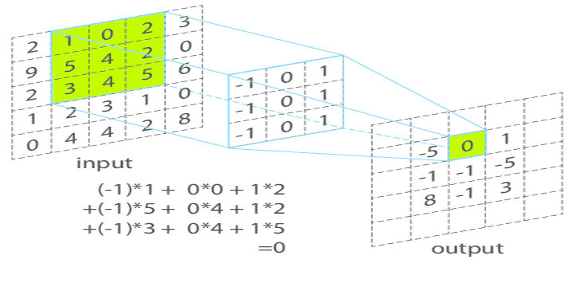
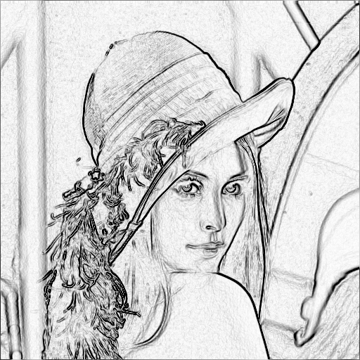

# Manipulations d'images (Seconde partie)

## Fondu de deux images

On peut, à partir de deux images, créer un mélange des deux. Pour cela, on commence par choisir dans quelle proportion on veut les mélanger (par exemple 60% de la première et donc 40% de la seconde). Ensuite, il suffit de prendre, pour chaque couleur de chaque pixel, 60% de la valeur de la première image et 40% de la valeur de la seconde image.

Ainsi, si par exemple le premier pixel de la première image est de couleur (10,20,30) et le premier pixel de la seconde image est de couleur (100,100,100) alors l'image mélangée sera de couleur `(0.6*10 + 0.4*100, 0.6*20 + 0.4*100, 0.6 * 30 + 0.4*100)` c'est à dire `(46, 52, 58)`.

Modifier le script suivant pour qu'il mélange `image` et `image2` avec une proportion de 60% de la première et 40% de la seconde.

::: Astuce numpy
Ici c'est presque trop facile puisque multiplier un tableau numpy par un nombre multiplie chacun de ses termes. 
Seul détail technique, il faut penser à transformer le résultat final en tableau à valeur entière inférieure à 255 (en appliquant `np.asarray(..., dtype=np.uint8)` au résultat).
:::

@[Fondu de deux images]({"stubs": ["Info/Manip_image_fondu.py"], "command": "sh -c 'python3 Info/Manip_image_fondu.py && python3 Info/afficher_images.py'"})

## Redimensionner

Supposons que nous voulions redimensionner notre image qui est de dimension *a0* lignes et *b0* colonnes en une nouvelle dimension *a1* lignes et *b1* colonnes. On peut noter alors les ratios des transformations selon les lignes et les colonnes : `ratio_lignes = a0/a1` et `ratio_colonnes = b0/b1`.  
Pour remplir notre nouvelle image, il suffit alors de remplir le pixel situé à la ligne *ligne* et la colonne *col* avec les couleurs du pixel de l'image de départ situé à la ligne `int(ligne*ratio_lignes)` et la colonne `int(col*ratio_colonnes)`.

Remarque : Si on fait ainsi, lors d'un agrandissement, plusieurs pixels de l'image de départ seront recopiés donnant une impréssion de gros pixels. Il existe beaucoup de façon d'empecher ce phénomène en lissant les couleurs par différentes méthodes mais nous ne nous y intéresserons pas ici.

Modifier le script suivant pour qu'il affiche une image en sortie de dimension 300 lignes et 300 colonnes. 

@[Redimensionner une image]({"stubs": ["Info/Manip_image_redimensionner.py"], "command": "sh -c 'python3 Info/Manip_image_redimensionner.py && python3 Info/afficher_images.py'"})

## Modifier le contraste

Pour chaque pixel de couleur (r,v,b), on peut définir son intensité par la moyenne des valeurs des 3 couleurs c'est à dire `i=(r+v+b)/3`. On a ainsi, si on parcourt tous les pixels de l'image, une intensité minimale `i_min` et une maximale `i_max`. L'idée, pour augmenter le contraste, est redimensionner la plage des intensités entre 0 et 255 de manière linéaire. Autrement dit, on veut que le pixel d'intensité `i_min` devienne d'intensité 0 et celui d'intensité `i_max` devienne d'intensité 255 et entre les deux, on modifie les valeurs de manière linéaire. Pour cela, un pixel d'intensité `i` à l'origine sera modifié en un pixel d'intensité normalisée  `i_n = 255 * (i-i_min)/((i_max-i_min)*i)` en multipliant chaque couleur par cette valeur. On fera bien attention à ce que le résultat soit un entier inférieur à 255.

Compléter le script suivant pour qu'il amplifie le contraste selon la méthode présentée ci dessus.

@[Modifier le contraste]({"stubs": ["Info/Manip_image_contraste.py"], "command": "sh -c 'python3 Info/Manip_image_contraste.py && python3 Info/afficher_images.py'"})


## Filtres

Les filtres sont des modifications un peu plus complexes de notre image que celle que nous avons vues. Ils demandent un traitement mathématique un peu plus conséquent mais qui est au final toujours le même. Ils vont nous permettre entre autre de flouter, réhausser les contours, ou détecter les contours. Comme cette partie est un peu plus complexe mais intéressante, j'ai préféré donner déjà des scripts qui fonctionnent pour ensuite les modifier légèrement si besoin.

### Présentation théorique

Pour modifier notre image, nous allons faire ce qu'on appelle une convolution de notre image par un noyau de dimension 3x3. Voici un résumé en image de la méthode :   
Le tableau de nombres sur la gauche représente notre image. Le tableau central (contenant des -1, 0 et 1) est notre noyau, fixé en fonction du filtre que l'on souhaite appliquer. Pour obtenir la valeur d'un pixel de notre image transformée, on "applique" notre noyau à la zone (en vert sur l'image) autour du pixel choisi de notre image d'origine. Pour l'appliquer, on multiplie simplement terme à terme puis on fait la somme. L'image est surement plus parlante que mes explications.  
On applique ainsi notre filtre sur chaque pixel pour lequel c'est possible (on voit bien qu'au bord il y a un problème).

Par exemple : Le calcul qui donne -5 comme premier pixel de l'image modifiée sur la figure ci-dessus est : (-1)x2 + 0x1 + 1x0 + (-1)x9 + 0x5 + 1x4 + (-1)x2 + 0x3 + 1x4 = -5

D'un point de vue formel, si notre `noyau` est sous la forme d'une matrice 3x3, on aura pour le pixel dont on connait la ligne `ligne` et la colonne `col` : `noyau[0,0]*image[ligne-1,col-1] + noyau[0,1]*image[ligne-1,col] + noyau[0,2]*image[ligne-1,col+1] + noyau[1,0]*image[ligne,col-1]+...+noyau[2,2]*image[ligne+1,col+1]`. On peut, bien sûr, écrire directement à la main ce calcul ou bien, comme ce sera fait dans les exemples, faire deux boucles de longueur 3 pour calculer cette somme.

Pour les puristes : Dans la suite, les pixels de bord sont simplement recopiés pour garder une image de même dimension.

### Premier exemple : Lisser une image

Pour lisser une image, il suffit de prendre comme noyau 1/9 partout pour que le calcul corresponde, pour chaque pixel, à faire la moyenne des 9 valeurs autour autrement dit :
```math
noyau = \frac{1}{9}
\begin{bmatrix}
1 & 1 & 1 \\
1 & 1 & 1 \\
1 & 1 & 1
\end{bmatrix}
```

On obtient le résultat suivant :

@[Lisser une image]({"stubs": ["Info/Manip_image_lisser.py"], "command": "sh -c 'python3 Info/Manip_image_lisser.py && python3 Info/afficher_images.py'"})

Il y a d'autres façons de lisser une image. On peut par exemple prendre un filtre gaussien qui prend un peu plus en compte le pixel central et un peu moins ceux qui l'entourent.

Modifier l'exemple précédent pour utiliser le filtre gaussien : 
```math
noyau = \frac{1}{16}
\begin{bmatrix}
1 & 2 & 1 \\
2 & 4 & 2 \\
1 & 2 & 1
\end{bmatrix}
```

### Deuxième exemple : Réhausser les contours

Un contour est un endroit de l'image où les pixels changent totalement de couleurs. Pour amplifier les contours, on peut donc utiliser un filtre de la forme :
```math
noyau =
\begin{bmatrix}
0 & -0.5 & 0 \\
-0.5 & 3 & -0.5 \\
0 & -0.5 & 0
\end{bmatrix}
```

@[Réhausser les contours d'une image]({"stubs": ["Info/Manip_image_rehausser_contours.py"], "command": "sh -c 'python3 Info/Manip_image_rehausser_contours.py && python3 Info/afficher_images.py'"})

Modifier le 3 en 2 dans le noyau précédent (ce qui fait une somme nulle des coefficients du noyau) pour voir apparaitre les contours.

En plus de transformer le 3 en 2, inverser les couleurs de l'image pour voir apparaitre seulement les contours. Cela donne une impression de dessin au crayon.

Remarque : L'utilisation de numpy oblige ici à modifier les typages pour que les calculs soient justes.

### Détection des contours

Grâce au filtre précédent, on a pu mettre en valeur les contours. Il existe des filtres encore plus efficaces pour détecter les contours. Nous allons donner l'exemple du filtre de Sobel. On applique en réalité 2 filtres qui sont : 
```math
noyau_v = 
\begin{bmatrix}
-1 & 0 & 1 \\
-2 & 0 & 2 \\
-1 & 0 & 1
\end{bmatrix}
\ et \ 
noyau_h =
\begin{bmatrix}
-1 & -2 & -1 \\
0 & 0 & 0 \\
1 & 2 & 1
\end{bmatrix}
```
Le premier détecte les contours "verticaux" et le second les "horizontaux". Pour le voir, vous pouvez mettre un puis l'autre comme noyau dans l'exemple précédent pour voir les contours mis en valeur.

L'idée est donc de faire les mêmes calculs que dans le cas d'un seul filtre. On obtient donc ici deux résultats `somme\_v` et `somme\_h`. Pour combiner ces deux résultats en un seul, on fait ici une moyenne quadratique $`\sqrt{somme_v^2+somme_h^2}`$ (car cela correspond en réalité à la norme d'un vecteur).

@[Detection des contours d'une image]({"stubs": ["Info/Manip_image_Sobel.py"], "command": "sh -c 'python3 Info/Manip_image_Sobel.py && python3 Info/afficher_images.py'"})

La détection des contours rend beaucoup mieux si on modifie avant notre image en niveau de gris et au final on inverse les couleurs. Modifier le script précédent pour le faire. Voici le résultat : 
