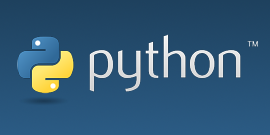

<h1> <center>Cours : Les boucles `for`</center></h1>



# Présentation des boucles `for`

La boucle `for` énumère les éléments d'un ensemble et pour chaque élément, répète toujours le même code en fonction de cet élément. Donnons un exemple :

``` python
for objet in liste_courses :
    trouver(objet)
    mettre_dans_le_chariot(objet)
aller_payer()
```
Détaillons un peu. Pour chaque objet dans ma liste de courses, je fais toujours la même chose : je le trouve puis je le mets dans le chariot. C'est ça que fait ma boucle `for`. Quand il n'y a plus d'objet dans ma liste de course, je vais payer.  
Attention au fait que, comme pour le `if... else...`, il ne faut pas oublier les ":" en fin de ligne et, de plus, ce qui doit être fait en boucle doit être indenté. Et le `aller_payer` n'est pas indenté car je ne paye qu'à la fin. S'il était indenté, cela signifierait que pour chaque objet j'irais payer avant de passer à l'objet suivant...

Passons à des exemples plus informatiques.  
Nous allons nous intéresser principalement à l'énumération de nombres car c'est de loin la plus utile au début. Pour créer une liste de nombres, on utilise la fonction `range`.

+ `range(n)` : crée une liste de n nombres allant de 0 à n-1.  
Et oui en informatique, il va falloir prendre l'habitude de toujours commencer à 0 et du coup finir à n-1 si on veut n nombres en tout.
+ `range(n1,n2)` : crée une liste de nombres allant de n1 à n2-1.
+ `range(n1,n2,pas)` : crée une liste de nombres allant de n1 à n2-1 en sautant de pas en pas.

Par exemple :  
- `range(4)` est la suite de nombres 0 1 2 3
- `range(3,6)` est la suite de nombres 3 4 5
- `range(1,9,3)` est la suite de nombres 1 4 7 (de 3 en 3 en partant de 1)
- `range(3,0,-1)` est la suite 3 2 1  (un pas négatif permet de compter à l'envers ce qui est très pratique des fois)

Passons à des exemples d'utilisation. Essayez d'abord de deviner le résultat puis appuyez sur Run pour vérifier.
```python runnable
for i in range(3) :
   print("Bonjour !")
```
```python runnable
for i in range(5) :
   print(i)
```
```python runnable
somme=0
for i in range(4) :
   somme+= i
print(somme)
```
Détaillons cet exemple :  
Pour `i` allant de 0 jusqu'à 3 (c'est à dire range(4)),  
je demande à chaque fois `somme += i` ce qui veut dire que je rajoute à `somme` la valeur `i` qui vaut tour à tour 0 puis 1 puis 2 puis 3.  
Finalement, j'affiche le résultat qui n'est autre que 0+1+2+3.

# QCM

Voici quelques QCM pour voir si vous avez bien compris. N'hésitez pas à relire ce qui précède si vous avez un doute.

###### QCM 1
```python
for k in range(3):
    print(k)
```  
?[Que va afficher ce programme (les `/` remplacent ici un retour à la ligne)? ]
-[ ] 0 / 1 / 2 / 3
-[x] 0 / 1 / 2
-[ ] 0 / 3 / 6
-[ ] 1 / 2 / 3

---

###### QCM 2
```python
for k in range(1,7,2):
    print(k)
```  
?[Que va afficher ce programme (les `/` remplacent ici un retour à la ligne)? ]
-[ ] 1 / 3 / 5 / 7
-[ ] 1 / 2 / 3 / 4 / 5 / 6
-[ ] 1 / 2 / 3 / 4 / 5 / 6 / 1 / 2 / 3 / 4 / 5 / 6
-[x] 1 / 3 / 5 

---

###### QCM 3
```python
for k in ... :
    print(k)
```  
?[Par quoi remplacer les ... pour que le programme précédent affiche 3 / 6 / 9 / 12 (les `/` remplacent ici un retour à la ligne) ? ]
-[ ] range(3,12,3)
-[x] range(3,13,3)
-[ ] range(13,3)
-[ ] range(3, 13)

---

###### QCM 4
```python
for k in range(5):
    print(k*k + k)
```  
?[Que va afficher ce programme (les `/` remplacent ici un retour à la ligne)? ]
-[ ] 2  / 6 / 12 / 20 / 30
-[ ] 0 / 1 / 2 / 3 / 4 
-[ ] 0 / 1 / 4 / 9 / 16 
-[x] 0 / 2 / 6 / 12 / 20 

---

###### QCM 5
```python
somme = 0
for n in range(4):
    somme += n*n
print(somme)
```  
?[Que va afficher ce programme (les `/` remplacent ici un retour à la ligne)? ]
-[x] 14
-[ ] 6 
-[ ] 39 
-[ ] 0 / 1 / 4 / 9 
-[ ] 0 / 1 / 5 / 14

---

###### QCM 6
```python
somme = 0
for n in range(5):
    somme += ...
print(somme)
```  
?[Que mettre à la place des ... pour que ce programme affiche la valeur de la somme 2*0 + 2*1 + 2*2 + 2*3 +2*4 ? ]
-[ ] n
-[x] 2*n 
-[ ] n*n
-[ ] 2*0 + 2*1 + 2*2 + 2*3 +2*4


# Entrainement 

### Exercice 1

On a recopié ci-dessous le programme de l'exemple précédent.
Modifier ce programme pour qu'il affiche la somme des entiers de 3 à 172 c'est à dire 3 + 4 + 5 + ... + 171 + 172.

@[Exercice 1]({"stubs": ["Les_boucles/for_exo_1.py"], "command": "python3 Les_boucles/for_exo_1_Test.py"})

---

### Exercice 2

On a recopié de nouveau ci-dessous le programme de l'exemple précédent.
Modifier ce programme pour qu'il affiche la somme des carrés des entiers de 5 à 123 c'est à dire 5² + 6² + 7² + ... + 122² + 123².

@[Exercice 2]({"stubs": ["Les_boucles/for_exo_2.py"], "command": "python3 Les_boucles/for_exo_2_Test.py"})

---

### Exercice 3

En s'inspirant des programmes précédents, créez un programme qui affiche, pour chaque entier entre 0 et 100, son carré. Autrement dit, il doit afficher :

    0  
    1  
    4  
    9  
    16 
    ...
    10000

@[Exercice 3]({"stubs": ["Les_boucles/for_exo_3.py"], "command": "python3 Les_boucles/for_exo_3_Test.py"})
