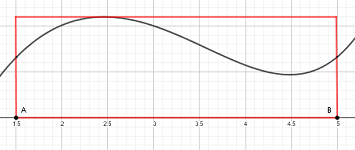
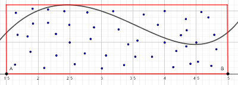

# Méthode de Monte Carlo pour le calcul d'aire.
`Difficulté : Moyenne`

Le but de cette fiche est de présenter la méthode de Monte Carlo pour calculer l'aire sous une courbe représentative d'une fonction. Pour simplifier, on supposera ici que nos fonctions sont toutes positives sur l'intervalle sur lequel on les considère.

Définissons d'abord ce qu'est l'aire sous la courbe représentative d'une fonction sur un intervalle [a,b] : C'est tout simplement l'aire comprise entre la courbe représentative, l'axe des abscisses et les droites x=a et x=b.

Décrivons à présent la méthode de Monte Carlo pour calculer l'aire sous la courbe d'une fonction f sur un intervalle [a,b] :
1. On choisit un rectangle qui contient l'aire qui nous intéresse. Le plus simple est de prendre le rectangle dont un coté est le segment [AB] où A(a,0) et B(b,0) et dont l'autre coté vaut le maximum de f sur [a,b].
 
2. On choisit des points au hasard dans le rectangle. Plus le nombre de points est important plus notre résultat sera précis.

3. On compte le nombre de points qui sont dans la surface que l'on cherche à approximer (ici on compte les points sous la courbe).
4. L'approximation de l'aire cherchée est alors $`\dfrac{nombre\ de\ points\ dans\ la\ surface}{nombre\ total\ de\ points}\times Aire_{Rectangle\ choisi}`$

Créez un programme qui prend en entrée une fonction ***f*** et les deux bornes ***a*** et ***b*** de l'intervalle et qui affiche (avec `return`) une approximation de l'aire  sous la courbe représentative de ***f*** sur l'intervalle [a,b] calculée par la méthode de Monte Carlo en utilisant 100 000 points aléatoires. Pour valider le test, il faut trouver une valeur à 0.01 près de la valeur exacte.

::: Aide
Pour trouver le maximum de la fonction ***f*** sur l'intervalle [a,b], on pourra soit se créer une fonction personnelle qui fait le calcule ou bien utiliser directement la fonction ***maximum(f,a,b)*** dont vous pouvez voir le code en changeant d'onglet dans la fenetre de programmation ci dessous.
:::

@[Calcul d'aire par la méthode de Monte Carlo]({"stubs": ["Maths/Monte_carlo.py","Maths/Trouver_max_fonction.py"], "command": "python3 Maths/Monte_carlo_Test.py"})
