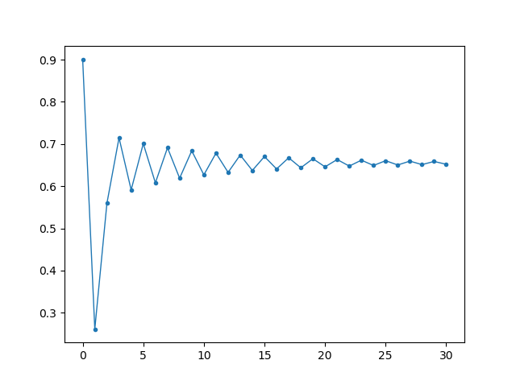

# La suite logistique
`Difficulté : de Facile à Difficile`  
`Prérequis : Les listes`

La suite est très intéressante à étudier car c'est un des exemples les plus simples qui permettent d'observer ce que l'on appelle le chaos. C'est l'équivalent en physique du double pendule : un phénomène simple et pourtant imprévisible. On pourra lire [Wikipédia](https://fr.wikipedia.org/wiki/Th%C3%A9orie_du_chaos) pour plus d'information sur la théorie du Chaos.

Le but de cette page est donc de présenter la suite logistique et toucher du doigt son coté chaotique.

## Définition de la suite
`Difficulté : Facile`

On appelle suite logistique la suite définie pour un réel $`\mu>0`$ par $`u_{n+1}=\mu u_n(1-u_n)`$.

Créer une fonction `u(mu,u0,n)` qui prend en entrée le paramètre $`\mu`$ (mu), le premier terme $`u_0`$ et un entier ***n*** et renvoie en sortie la ***liste*** des termes de la suite de $`u_0`$ jusqu'à $`u_n`$.

@[Définition des suites]({"stubs": ["TP/logistique.py"], "command": "python3 TP/logistique_Test.py"})

---

## Représentation graphique I
`Difficulté : Facile`

Une première façon de représenter notre suite est de manière classique c'est à dire n selon les abscisses et $`u_n`$ selon les ordonnées.

Créer une fonction `dessiner(mu,u0,n)` qui affiche avec matplotlib les points associés à la suite allant de $`u_0`$ jusqu'à $`u_n`$. On pourra utiliser la fonction `plt.plot(X,Y,".-",linewidth=1)` pour afficher les points et les relier. Le résultat devra ressembler à 

> Remarques : Il n'y a pas de vérificateur car c'est une fonction graphique.  
Ne pas oublier de copier coller votre fonction `u(mu,u0,n)`.  
Pour la dernière courbe affichée, on peut voir que plus la valeur de $`\mu`$ augmente, plus la suite devient chaotique dans le sens où il devient difficile de prédire la valeur de $`u_n`$ alors que pour  $`\mu=1,6`$, c'est très facile vu qu'elle se "stabilise" autour d'une seule valeur.

@[Représentation graphique 1]({"stubs": ["TP/logistique_graphique1.py"], "command": "python3 TP/logistique_graphique1_Test.py"})

## Représentation graphique II
`Difficulté : Difficile`

Nous allons à présent représenter notre suite par sa représentation dite "en escalier". Cela ressemble à ceci pour $`mu=2.8`$ et $`u_0=0.9`$ : 

On y représente la fonction $`f(x) = \mu x(1-x)`$ ainsi que la droite $`y=x`$.  Pour dessiner cette représentation, voici la démarche :  
On part de $`x=u_0`$, pour obtenir graphiquement la valeur de $`u_1`$, il suffit de regarder sur l'axe des ordonnées la valeur de $`f(u_0)`$. Le problème est que pouvoir refaire la même opération, il faudrait pouvoir situer $`u_1`$ sur l'axe des abscisses. Un première façon serait de prendre un compas et reporter la longueur mais on peut faire plus simple avec simplement une règle : On reporte horizontalement la valeur de $`u_1`$ sur la droite $`y=x`$ (puisque les points de cette droite on même abscisse et ordonnée) puis on redescend vertivalement sur l'axe des abscisses pour avoir notre valeur $`u_1`$ sur l'axe des abscisses.  
On recommence ainsi de suite pour calculer $`u_2`$, $`u_3`$...

Dans la pratique, comme sur la figure ci-dessus, on enchaine directement les traits sans aller aux axes. Cela donne à chaque fois les deux étapes :
- On joint verticalement le point $`(u_i,u_i)`$  au point $`(u_i,u_{i+1})`$.
- On joint horizontalement le point $`(u_i,u_{i+1})`$ au point $`(u_{i+1},u_{i+1})`$.

A vous maintenant de compléter la fonction `dessiner(mu,u0,n)` pour qu'elle affiche la représentation en escalier de la suite logistique c'est à dire dessiner la foncion $`f`$, la droite $`y=x`$ et "les escaliers" formés par les termes de la suite selon la description précédente.

@[Représentation graphique 2]({"stubs": ["TP/logistique_graphique2.py"], "command": "python3 TP/logistique_graphique2_Test.py"})

---

## Sensibilité aux conditions initiales
`Difficulté : Moyenne`

---

## Diagramme de bifurcation
`Difficulté : Difficile`

---

## Prolongements possibles

On pourra observer les comportements d'autres suites comme par exemple $`u_{n+1}=\mu sin(u_n)`$ ou $`u_{n+1}=\mu- u_n^2`$.

Un prolongement possible est aussi l'étude de la fonction logistique $`f(x)=\mu x(1-x)`$ mais sur l'ensemble des nombres complexes. On obtient alors l'ensemble de Mandelbrot.
