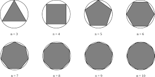

# Approximation de $`\pi`$ par des polygones réguliers
`Difficulté : Moyenne`
`Prérequis : Trigonométrie (pour les justifications)`

Le but de cette page est de présentée la méthode d'Archimède pour approximer la valeur de $`\pi`$ en utilisant des polygones réguliers inscrits dans le cercle.  
L'idée est de considérer un cercle de rayon 1. Son périmètre est alors de $`2\pi`$. Si on trace un polygone régulier inscrit dans ce cercle, avec un nombre de coté suffisamment grand, son périmètre devrait alors être proche de la valeur $`2\pi`$.

## Première méthode

En partant de la remarque précédente, nous allons donc calculer le périmètre d'un polygone régulier inscrit dans un cercle de rayon 1 en fonction de son nombre de côté pour obtenir une approximation de $`2\pi`$ puis diviser le résultat par 2 pour obtenir celle de  $`\pi`$.

> Question mathématique : On peut trouver sur [Wikipédia](https://fr.wikipedia.org/wiki/Polygone_r%C3%A9gulier) que la mesure d'un côté d'un polygone à n côtés est $`c = 2 sin(\dfrac{\pi}{n}`$.  
Prouver le puis en déduire la valeur du périmètre en fonction de $`n`$.

Créer un programme utilisant la formule ci-dessus qui prend en entrée un entier $`n`$ et donne en sortie une approximation de $`\pi`$. (Penser à diviser par 2 le périmètre !)

@[Première méthode]({"stubs": ["TP/approx_pi_1.py"], "command": "python3 TP/approx_pi_1_Test.py"})
